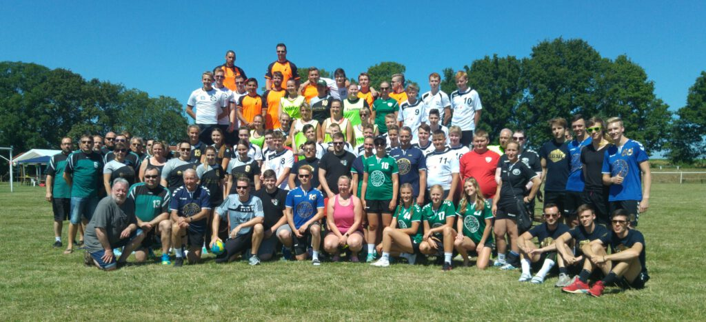
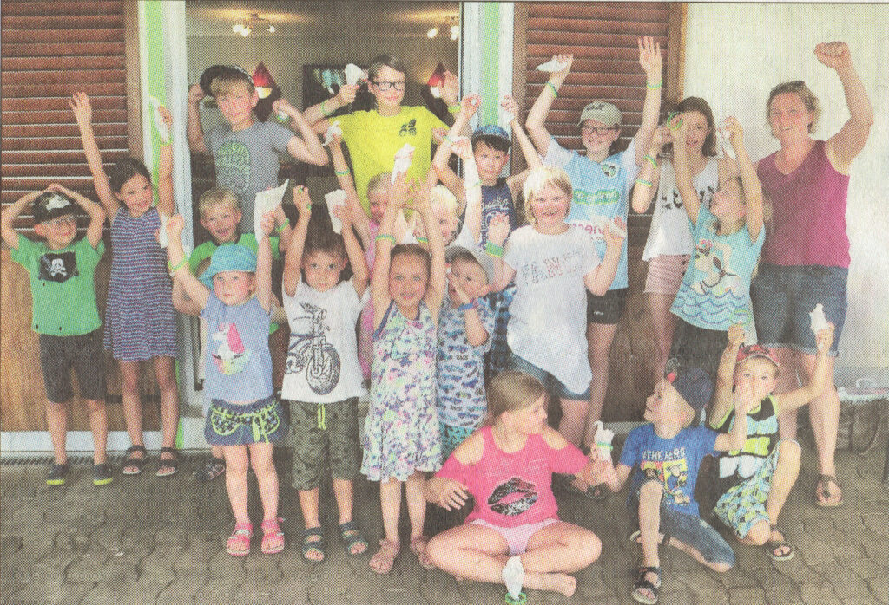
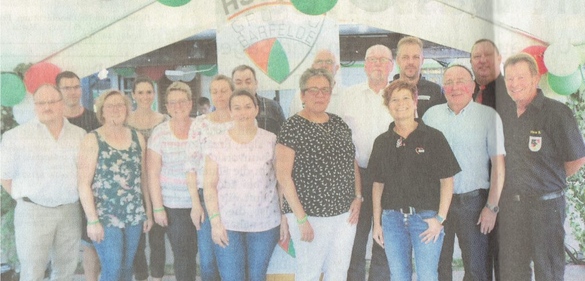

Zum 10. Geburtstag der Handballspielgemeinschaft veranstaltete der Vorstand der HSG09 für Mitglieder und Freunde ein ereignisreiches Wochenende.

Nachdem am Freitag, den 28.Juni 2019 die Feierlichkeiten mit einem Kommers eröffnet wurden, ging es an den nächsten beiden Tagen sportlich zu.

Am Samstag tobten sich zunächst die "Großen" beim Rasen-Kleinfeld- und Beachhandball aus. Da an dem Damenturnier nur 3 Mannschaften teilnahmen, wurde eine Runde auf Rasen und eine Runde auf Sand gegeneinander gespielt. Sieger bei diesem Turnier wurde die Mannschaft HSG X vor der Mannschaft HSG Y und den Damen des MTV Elze. Bei den Männern trafen insgesamt 6 Mannschaften bei einem Rasen-Kleinfeldturnier aufeinander. Das Team "Gas im Glas" wurde ungeschlagen Sieger vor dem Team "08/15", den Herren des MTV Elze, der HSG3, der männlichen B-Jugend und der männlichen A-Jugend. Nach der anschließenden Siegerehrung ging die Party richtig los und bei heißen Klängen aus den Boxen von DJ Martin wurde bis in die frühen Morgenstunden gefeiert.

Am Sonntag waren dann die "Kleinen" auf dem Barfelder Sportplatz an der Reihe. Bei einer Spaß-Olympiade zeigten die Kids zwischen 5 und 14 Jahren was sie alles drauf haben. Durch die heißen Temperaturen war die Veranstaltung zwar nach einer guten Stunde schon beendet, aber die Jüngsten der HSG09 freuten sich bei der Siegerehrung über "Süßes" und ein grünes Armband, das alle an das 10-Jährige Jubiläum der HSG09 erinnert.

- 
    
- 
