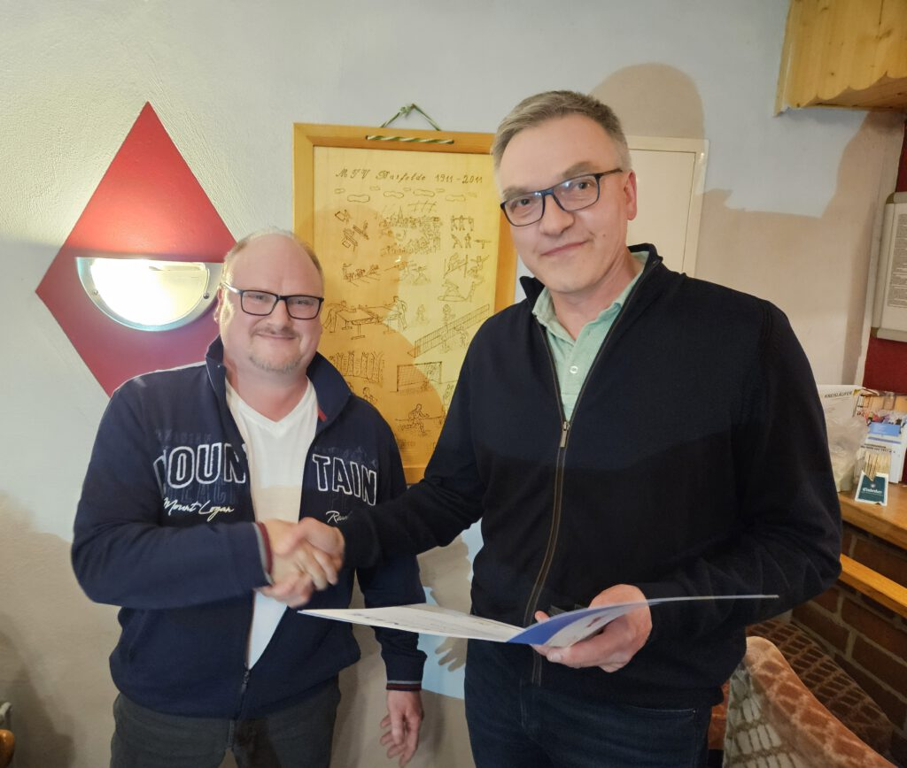
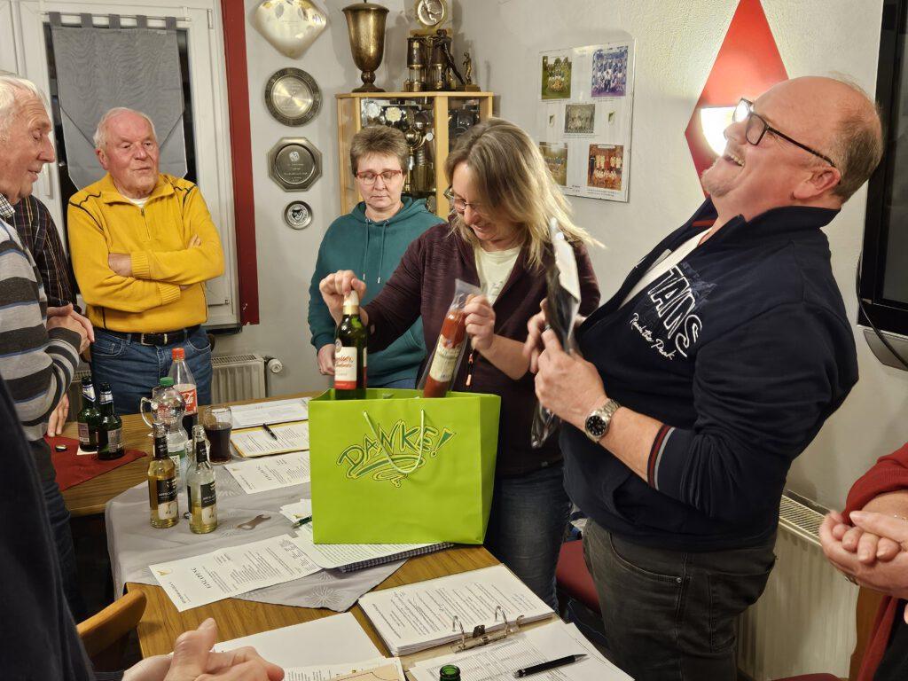
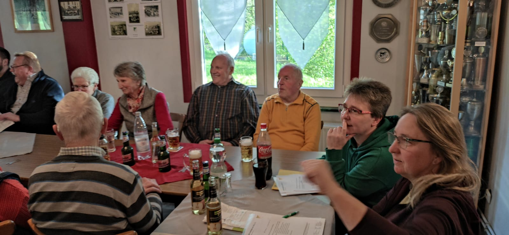
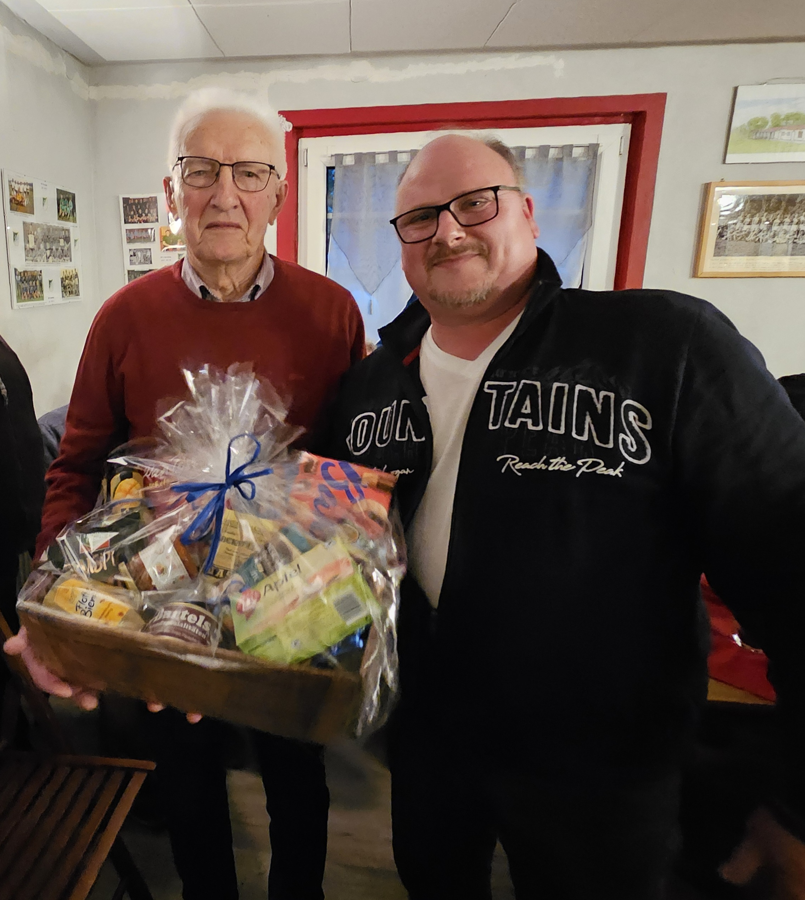

Für seine Verdienste um den MTV Barfelde ist der langjährige Erste Vorsitzende Henning Koch mit der goldenen Ehrennadel des Landessportbundes ausgezeichnet worden. Henning Koch gehörte dem Vorstand insgesamt 24 Jahre an, war in den vergangenen zwölf Jahren Vorsitzender. Sein Nachfolger ist Eike Wilkens, der in der gut besuchten Jahreshauptversammlung einstimmig zum neuen Vorsitzenden gewählt wurde.

> Dr. Stefan Rössig überreicht die goldene Ehrennadel des Landessportbundes an Henning Koch

Es war ein emotionaler Moment, als Henning Koch noch einmal die Gründe für seinen Rücktritt gegenüber den 46 stimmberechtigten Mitgliedern im Sporthaus darlegte. „Ich bin einfach leer. Ausgebrannt. Ich habe zu wenig Energie, um den anderen und dem Amt gerecht zu werden“, sagte Koch. Gleichwohl werde er im Verein aktiv in der „zweiten oder dritten Reihe“ weiter mitarbeiten.

Als stellvertretender Vorsitzender des Kreissportbundes würdigte Dr. Stefan Rössig die Verdienste Kochs: „Der MTV Barfelde ist zu seinem Verein geworden“, sagte Rössig bei der Verleihung der goldenen Ehrennadel unter dem langanhaltenden Beifall der Versammlung.

Worte des Dankes richtete die 2. Vorsitzende Melanie Harbusch an Henning Koch. Der habe bei allen anstehenden Aufgaben stets mit angepackt und sei sich für nichts zu schade gewesen.

> Zum Abschied aus dem Vorstand überrascht Melanie Harbusch Henning Koch mit mehreren Präsenten.

Wie vielfältig das sportliche Angebot des MTV Barfelde ist, ging aus den Berichten der Fachausschüsse sowie der HSG 09 Gronau/Barfelde hervor. Dass der Verein damit auf dem richtigen Weg ist, ließ sich auch an der Mitgliederentwicklung ablesen. Hier gab es einen Zuwachs auf jetzt aktuell 427 Mitglieder. Trotz dieser positiven Nachricht gab es nach den Worten von Kassenwartin Heidrun Schwartz aufgrund gestiegener Kosten einen Fehlbetrag in Höhe von 562,96 Euro im Vergleich zum Vorjahr.

> Mit 46 stimmberechtigten Mitgliedern war die Jahreshauptversammlung gut besucht.

Die Wahlen an diesem Abend brachten durch die Bank einstimmige Ergebnisse:  Erster Vorsitzender: Eike Wilkens. Schriftführerin: Dunja Heinemeyer. Sportwartin: Katharina Wunstorf. Pressewart: Peter Rütters. Ehrenrat: Heiner Kreth, Werner Nolte, Jürgen Klingebiel, Wolfgang Euling, Henning Koch. Vertreter im Förderverein der Sporthalle Despetal: Henning Koch.

Mit einem Präsentkorb wurde Reinhard Gläser an diesem Abend für 70-jährige Vereinsmitgliedschaft geehrt. Dier silberne Ehrennadel für 25-jährige Mitgliedschaft erhielten Astrid Baxmann und Pia Beneke. Eine Urkunde für 50-jährige Vereinstreue gab es für: Rüdiger Büttner, Bernd Hunze, Henning Koch, Sabine Koch, Robert Koch, Ilka Mensing und Cord Ulrich.

> Einen Präsentkorb für 70-jährige Mitgliedschaft überreichte Henning Koch an Reinhard Gläser.
