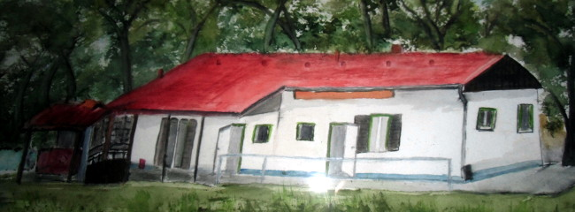
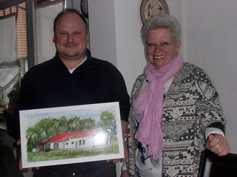

Margrit Buschbaum aus Elze, Hobbymalerin und Ehefrau unseres Mitglieds Günther Buschbaum, hat ein Aquarell unseres Vereinsheims angefertigt. Als Vorlage diente ein Foto, das ihr Vorsitzender Henning Koch zu diesem Zweck Anfang des Jahres zur Verfügung gestellt hatte. Margrit Buschbaum war anfangs skeptisch, ob ihr dieses Vorhaben gelingen würde, da sie ein so geradliniges Gebäude bislang noch nie zum Hauptmotiv ihrer Zeichnungen gemacht hatte.

Große Freude herrschte dann aber am 11. März, als die Künstlerin ihr Bild an Henning Koch übergab. Seit diesem Tag kann sich auch jeder selbst im Sporthaus davon überzeugen, dass das Werk gelungen ist; es hängt über der Eingangstür im Gastraum.

Vielen herzlichen Dank an Margrit Buschbaum für ihre tolle künstlerische Arbeit!

