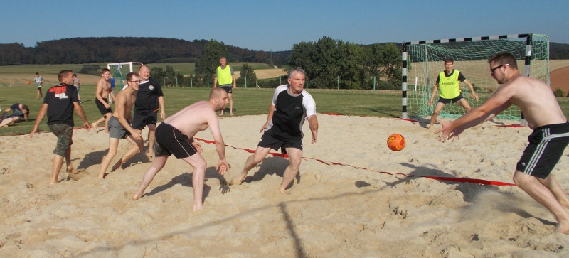

Das waren schon wirklich perfekte Bedingungen für das Beach-Handballturnier. Eigentlich sollte das Turnier viel früher stattfinden, wurde jedoch um gut einen Monat in den Spätsommer verschoben, weil es sonst eine Kollision mit der Jubiläumsfeier der Reservisten gegeben hätte. Tja, es war ein echter Glücksfall, bei super Sommerwetter mit 30 Grad und fast keiner Wolke am Himmel startete am Samstag (27.08.2016) das Beachhandballturnier auf dem Barfelder Sportplatz.

Wie in den letzten Jahren auch, wurde unser großes Jahresevent zusammen mit der HSG veranstaltet, sodass auch viele Gronauer den Weg auf unseren Sportplatz fanden.

Gleich am Samstag wurde die Spiele der Damen- und der Herren-Mannschaften ausgetragen. Insgesamt 9 Teams kämpften fair um den Sieg und wurden nicht nur vom schönen Wetter im "großraum Sandkasten" belohnt.

Die Stimmung war einfach bombig!

Nach dem sportlichen Erfolg kam dann auch schnell das Abendprogramm in Fahrt, denn auf der Agenda standen viele viele Mitgliederehrungen. Insgesamt wurde knapp 60 Mitglieder geehrt! Und ... wer kann es glauben: Es wurden Mitglieder für 25, 40, 60, 70 uns sogar 80 jährige Mitgliedschaft geehrt! Das muss man sich mal vor Augen führen: 80 Jahre dem MTV im Sport und im Ehrenamt treu verbunden. Respekt!

Die Leitung der Musik-Kapelle wurde von DJ Frank übernommen. Mit kräftigem Bass und perfekt auf den Abend abgestimmter Musik hat er für super Sommerfeeling und Partylaune gesorgt. Nun konnte jeder auch die gute Planung kosten, denn diesmal wurde Budweiser Bier vom Fass ausgeschenkt und das kam super gut an. Auch die Cocktails aus dem extra einbestellten Cocktailmobil verkauften sich recht gut, bis dem Cocktailmann dann die Betriebsmittel ausgingen. (Ausverkauft!). Nun ja, es gibt Potenzial zur Verbesserung!

Die Partystimmung blieb bis ganz zum Schluss auf dem Höchstpunkt; daran werden sich viele ganz lange, sehr gern zurückerinnern.

Am Sonntag stand dann das Jugendturnier auf dem Plan. Trotz langem Vorabend waren alle rechtzeitig am Start, damit die 7 gemischten Mannschaften zwischen 5 und 14 Jahren im Sand gegeneinander antreten konnten. Natürlich kam es bei den immernoch recht hohen Temeraturen nicht auf den Sieg an, sondern auf den Teamgeist und den Spass am Handballspielen. Und das Konzept ging auf: Mit teilweise sehr wenigen Auswechselspielern gruben sich die Mannschaften durch den Sand und bewiesen ihr gutes Durchhaltevermögen. Zwischen und während der Spiele konnte sich jedes Kind mit einer eigenen Trinkflasche ausreichend erfrischen, denn alle bekamen eine eigene Trinkflasche geschenkt. So startet jedes Kind auch gut ausgerüstet in die nächste Saison.

Ergebnisse Damenturnier

1. Die Sandflöhe
2. Die Beachies  
   Teamplayer
3. Baywatch
4. Golden Girls

Ergebnisse Herrenturnier

1. Der Bauwagen
2. Sportgruppe Schulle
3. Sportgruppe Dirk
4. Lokomotive nackich
5. Dynamo Tresen
