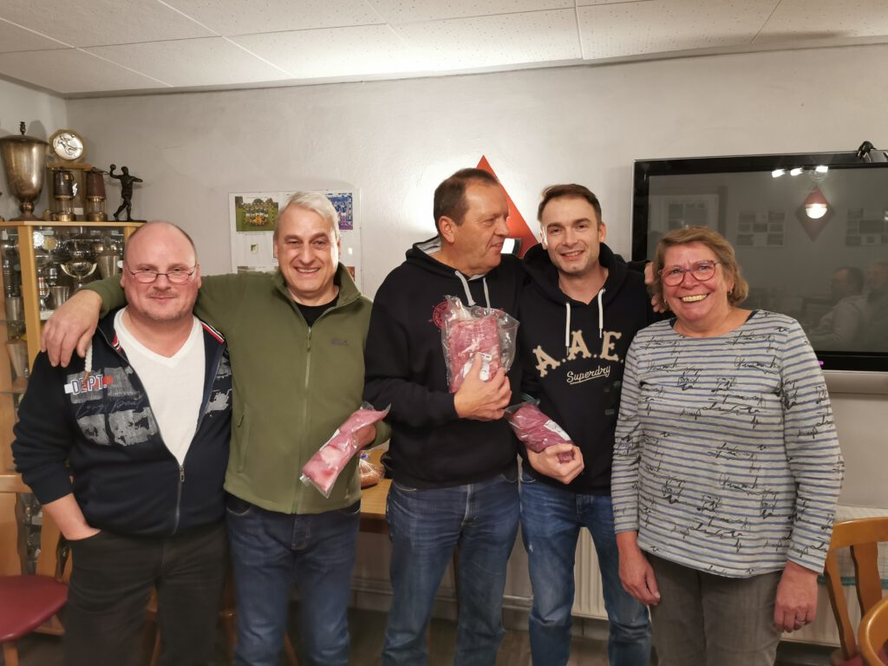
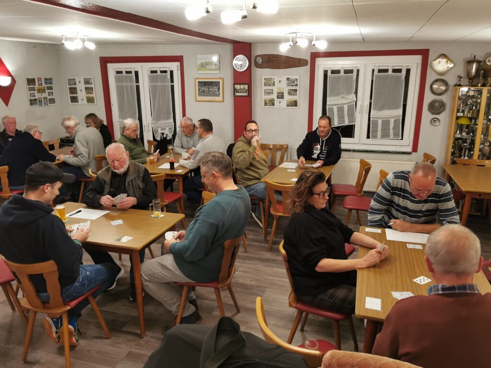

Beim traditionellen Preisskat des MTV Barfelde ging es auch in diesem Jahr wieder um attraktive Fleischpreise. 18 Spielerinnen und Spieler waren im Vereinsheim angetreten, um in lockerer Atmosphäre den Sieger zu küren. Nach drei Durchgängen hatte Jörg Großkreutz mit 2176 Punkten die Nase vorn. Auf den Plätzen zwei und drei folgten Chris Papke (1883 Punkte) und Harry Schiller (1380). Aber auch alle anderen Skat-Brüder und -Schwestern gingen an diesem Abend nicht leer aus, da es für jeden einen Preis gab. Das Turnier hatte Petra Möller wie immer bestens organisiert und damit für einen reibungslosen Ablauf der Spiele gesorgt.

Jörg Großkreutz (Mitte) freut sich über den ersten Platz. Das Bild zeigt von links den MTV Vorsitzenden Henning Koch, Harry Schiller, Chris Papke und Organisatorin Petra Möller. Fotos: Peter Rütters

18 Spielerinnen und Spieler traten zum Preisskat im Vereinsheim an.
