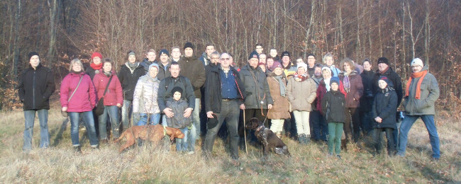

Mit 80 Füßen und 12 Pfoten machte sich der MTV Barfelde bei bestem Wanderwetter auf zur Braunkohltour. Vom Treffpunkt an der Barfelder Bushaltestelle ging es hinauf zum Hildesheimer Wald, durchs Eitzumer Holz und den Linkweg hinunter nach Eitzum. Hier standen - wie jedes Jahr - im Carport eines Mitglieds warme und kalte Getränke für die Wanderer bereit. Nach der Rast ging es weiter über den "Katzenberg" nach Nienstedt, wo sich die Gruppe das Niedersächsische Nationalgericht im Gasthaus Klingebiel vortrefflich schmecken ließ.

Im weiteren Verlauf des Abends wartete Vorsitzender Henning Koch mit einem unterhaltsamen Spiel auf, bei dem es galt in Schuhkartons verpackte Dinge zu erfühlen. Die Wanderer mit dem besten "Fingerspitzengefühl" durften einen kleinen Gewinn in Empfang nehmen.
