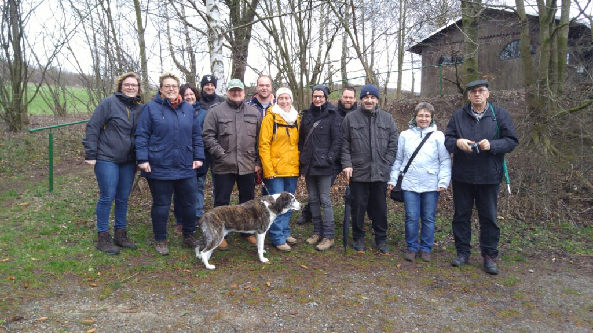

Zum Abschluss der Braunkohl-Saison zog es die Mitglieder des MTV Barfelde noch einmal an die frische Luft.

21 Frauen und Männer hatten sich beim Vorsitzenden Henning Koch angemeldet, um sich das typisch niedersächsische Gericht im "Hönzer Eck" noch einmal schmecken zu lassen.

Start für die Wanderer war an der Barfelder Bushaltestelle, bevor an der Eitzumer Bormstalhütte ein Zwischenstopp mit Glühwein und Kaltgetränken eingelegt wurde.

Nach drei Stunden erreichte die Gruppe das Gasthaus, um den Tag mit einem deftigen Essen ausklingen zu lassen.

Eine Teilnehmerin musste allerdings draußen bleiben: Es war Kochs Mischlingshündin Ronja, die die Strecke zwar mit Bravour meisterte, sich aber mit einer Streicheleinheit zufrieden geben musste.

Quelle: Peter Rütters / Leine Deister Zeitung vom 25.03.2019
