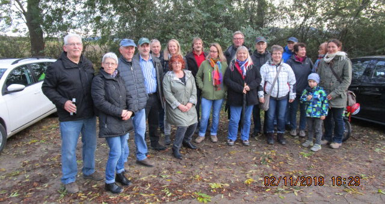
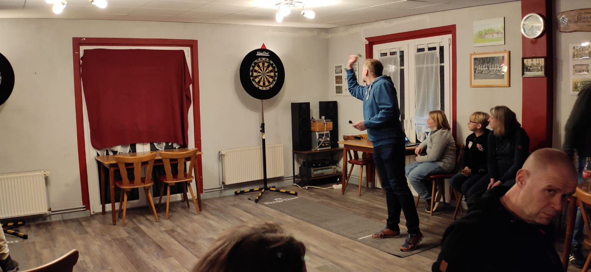
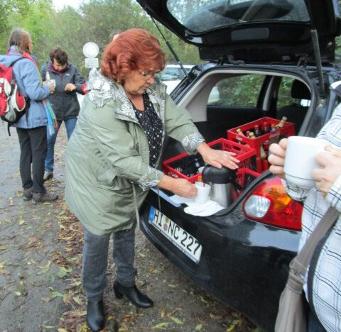
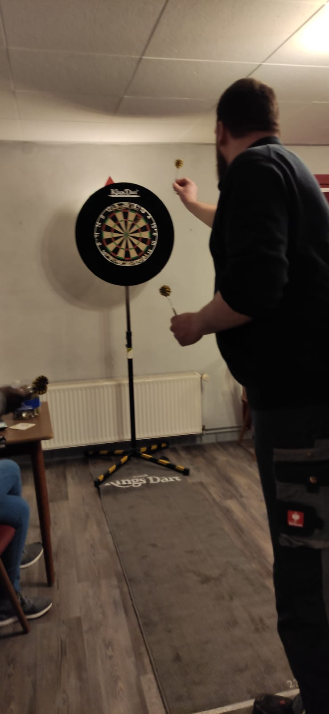
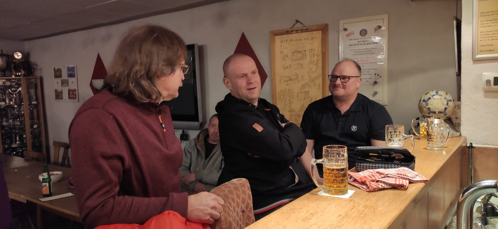

Da im September diesen Jahres der Familienwandertag ausgefallen war, beschloss der Vorstand des MTV Barfelde stattdessen im November zu einer Braunkohlwanderung einzuladen. Und wie sich herausstellte, war diese Idee ein voller Erfolg.

Mit 17 Personen machte man sich am Samstagnachmittag auf den Weg in Richtung Eddinghausen. Nach ca. 1 Stunde Wanderung legte man eine kleine Pause an der "Geschworenen Hütte" ein. Hier konnte man sich mit einem traditionellen Heißgetränk aufwärmen, bevor es weiter Richtung Barfelde ins vereinseigene Sporthaus ging. Dort gesellten sich dann auch die "Nichtwanderer" dazu, so dass sich am Ende 30 Personen auf den leckeren Braunkohl freuten.

Es gab durchweg nur positive Rückmeldungen. Deshalb überlegt der Vorstand im nächsten Jahr diese Veranstaltung genauso zu wiederholen.

#### **Vielen Dank nochmal an alle Helfer !**

- 
- 
- 
- 
