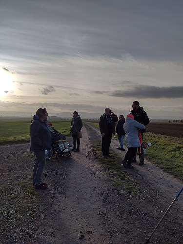
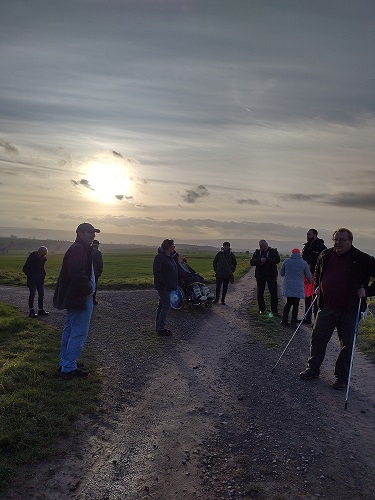
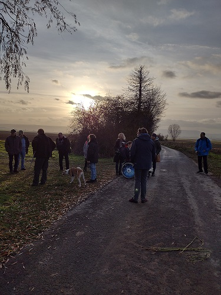
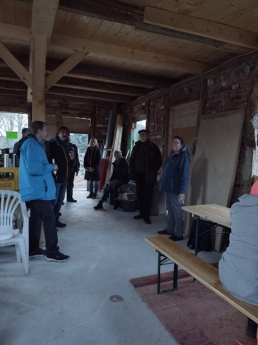
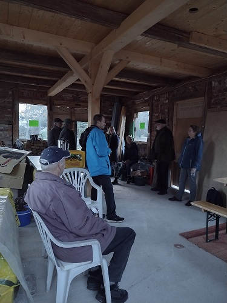
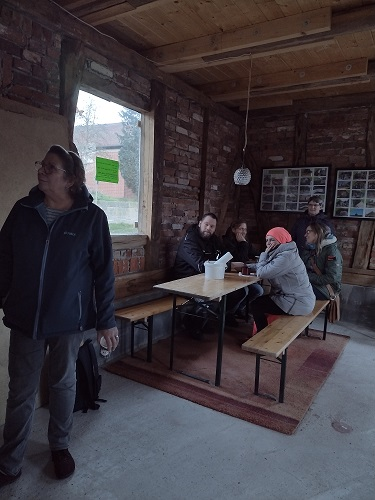
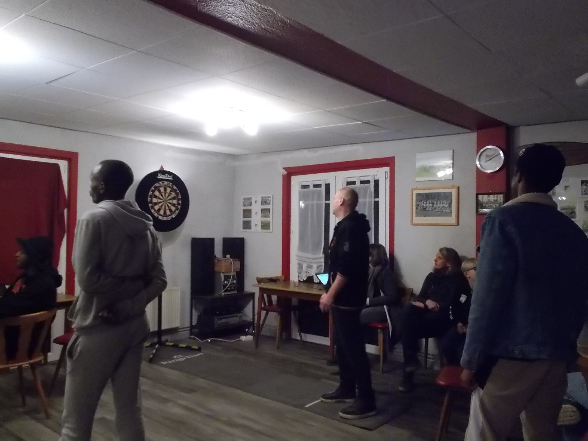
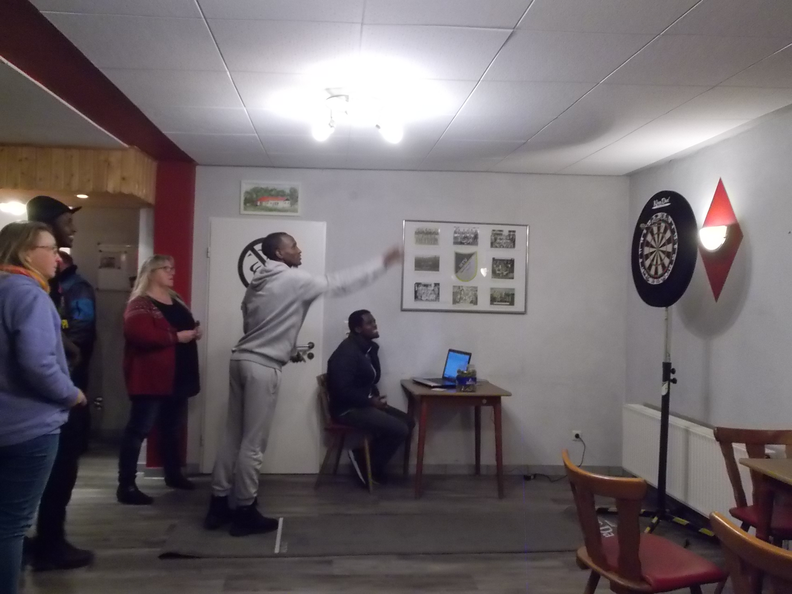
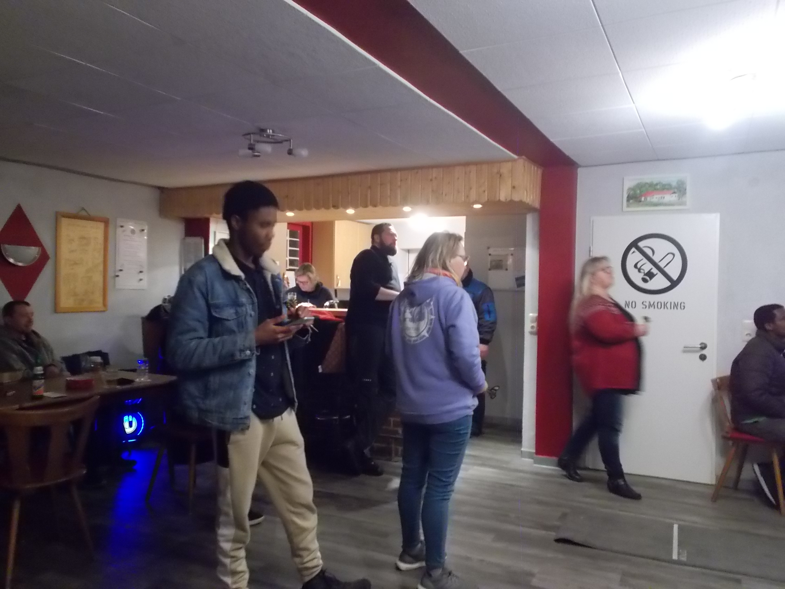

Am Samstag, den 26.November 2022 trafen sich die MTV-Mitglieder um 14.30 Uhr zur Braunkohlwanderung an der Bushaltestelle in Barfelde. Ziel war gegen 18 Uhr das vereinseigene Sporthaus um in den Genuss von Braunkohl und Bregenwurst zu kommen. Zwischenstation wurde dieses Mal in Eddinghausen am neuen Backhaus (Das Kleehus) gemacht. Sabine Koch sorgte für heiße und kalte Getränke während Herr Schimmelpfennig die Wanderer ausführlich über die Entstehung und weitere Planung des Backhauses informierte.

