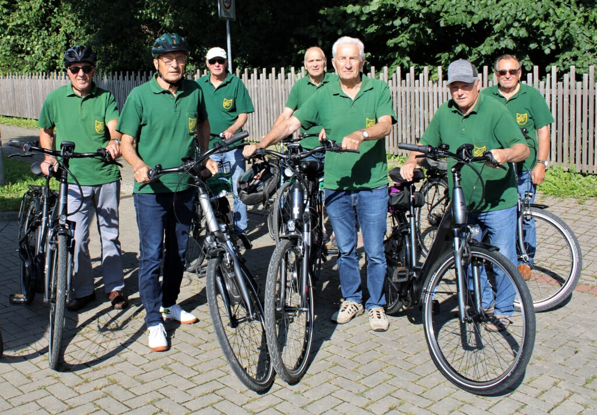
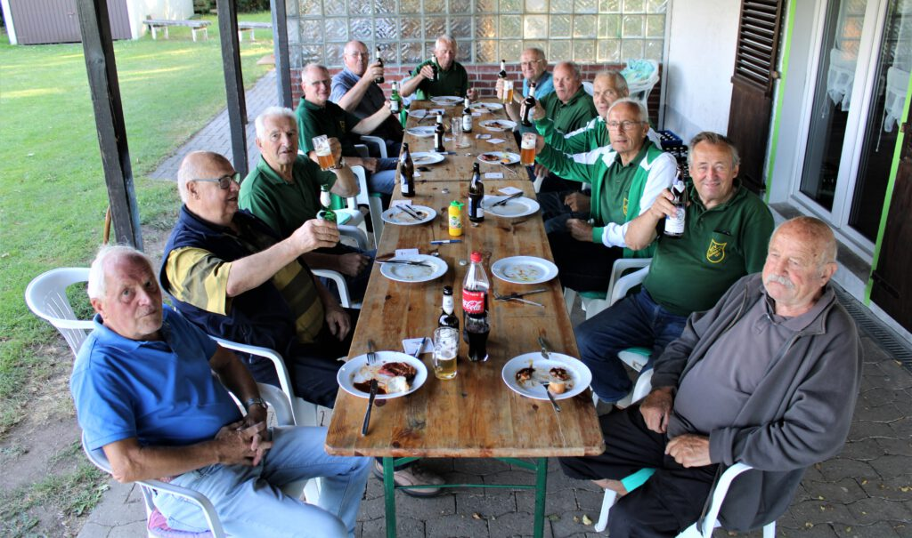

Sechs Wochen ohne Sport? Das kommt für die „Jedermänner“ des MTV Barfelde nicht in Frage. Da während der Sommerferien die Sporthalle in Eitzum für die Sportler geschlossen ist, haben sich die Männer schon vor Jahren nach einer Alternative umgesehen und sich aufs Fahrrad geschwungen. Auch in diesem Jahr tritt die Truppe ordentlich in die Pedale. So kommen an jedem Donnerstag in der Ferienzeit etliche Kilometer zusammen. Traditionell werden die Touren mit einem Imbiss beendet. Entweder in einem Lokal in der näheren Umgebung oder wie zuletzt am Sportplatz in Barfelde, wo zünftig gegrillt wurde. Dort gab es auch ein Wiedersehen mit dem ehemaligen Übungsleiter Siegmund Spendel, der immer wieder ein gern gesehener Gast bei den Jedermännern des MTV Barfelde ist.

