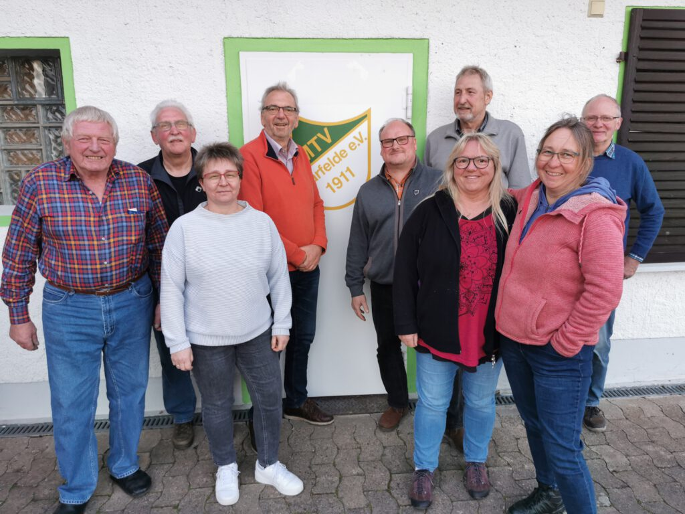

## Vereinsboss will 2024 nicht wieder kandidieren

Der MTV Barfelde muss sich im nächsten Jahr einen neuen Vereinsvorsitzenden suchen. Henning Koch kündigte in der Jahreshauptversammlung an, 2024 nicht wieder für dieses Amt zu kandidieren: „Ich muss Verantwortung abgeben, bleibe dem Verein aber natürlich erhalten“, sagte der Vorsitzende.

Die Ankündigung Kochs setzte den Schlusspunkt einer harmonisch verlaufenen Versammlung, an der allerdings nur 15 von insgesamt 408 Mitgliedern teilnahmen. Einstimmig wiedergewählt wurden die bisherige 2. Vereinsvorsitzende Melanie Harbusch und Kassenwartin Heidrun Schwartz. Das Engagement der beiden Frauen unterstrich Henning Koch in seinen Dankesworten. Er bezeichnete Melanie Harbusch als eine Kreativkraft, die nach ihrem Praktikum als stellvertretende Vorsitzende eine Erfolgsgeschichte im Verein geschrieben habe. Heidrun Schwartz ist nach den Worten Kochs nicht nur eine gute Kassenwartin, sondern auch der Dreh- und Angelpunkt bei der Bewirtung im Sporthaus. Zum neuen Kassenprüfer wählte die Versammlung Jens Hildebrandt.

Wie vielfältig das sportliche Angebot im MTV ist, wurde in den Berichten der Fachausschüsse deutlich. So war die Gymnastikgruppe „Fit for Fun“ im vergangenen Jahr wieder äußerst aktiv, stärkte die Muskeln und brachte die Gelenke in Bewegung. Nach den Worten von Heike Gittermann würde sich die Gruppe aber über weitere Teilnehmer freuen: „Wir bieten viel Abwechslung. Man kann vom Alltag abschalten, und man fühlt sich hinterher immer besser als vorher“, sagte Heike Gittermann. Das gilt auch für die Sparte der Jedermänner, die ebenfalls weitere Mitstreiter für die Männergymnastik sucht.

Schriftführerin Dunja Heinemeyer verlas die Berichte gleich für mehrere Sportangebote wie Eltern-Kind-Turnen, Zumba, Zumba-Kids, Tabata oder Bauch-Beine-Po. „Der Verein lebt“, lautete das Fazit des Vorsitzenden Henning Koch, der mit Dart, Nordic-Walking und Walking Handball drei mögliche Kandidaten für weitere neue Sparten ankündigte.

Von einem erfolgreichen Start des komplett neu aufgestellten Vorstands bei der HSG 09 Gronau/Barfelde berichtete Jonas Wiening. Das Team habe sich gut eingearbeitet und dabei viel gelernt. Sportlich laufe es besonders bei den beiden Herren-Mannschaften gut, die beide die ersten Plätze belegten und somit aufsteigen könnten.

Der Vorstand des MTV Barfelde.

Das Bild zeigt von links: Heiner Kreth, Werner Nolte, Dunja Heinemeyer, Peter Rütters, Henning Koch, Jürgen Klingebiel, Heidrun Schwartz, Melanie Harbusch und Wolfgang Euling. Foto: Schirdewahn
