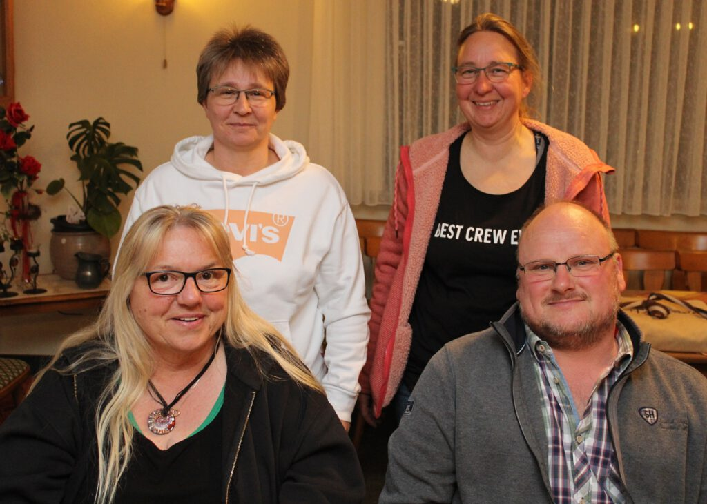
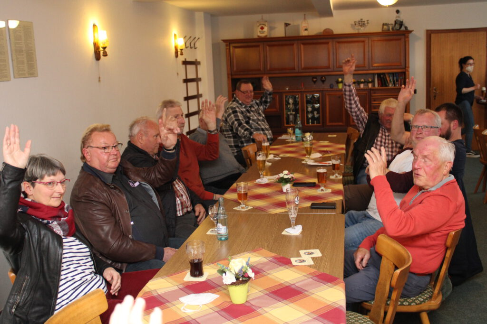

Barfelde. Die Krise bei der HSG 09 Gronau-Barfelde scheint abgewendet zu sein. Nachdem fast alle langjährigen Vorstandsmitglieder in einem Brandbrief angekündigt hatten, ihre Ämter wegen Arbeitsüberlastung und fehlender Unterstützung aus den eigenen Reihen niederzulegen, gibt es jetzt Hoffnung auf einen Fortbestand der Spielgemeinschaft. In der Jahreshauptversammlung des MTV Barfelde zeigte sich HSG-Vorstandsmitglied Andrea Strübig optimistisch, dass im Juni ein neuer Vorstand gewählt werden könne: „Der Brief zeigte Wirkung. Mehrere junge Mitglieder wollen sich im Vorstand engagieren“, sagte Strübig.

Diese Nachricht nahm der MTV-Vorsitzende Henning Koch mit großer Erleichterung auf: „Es gab die große Sorge, dass der Handball ansonsten zu Grabe getragen würde. Das hätte Barfelde stärker als Gronau getroffen“, sagte Koch, der von der Versammlung einstimmig im Amt bestätigt wurde.

Die Corona-Pandemie hat auch im zurückliegenden Jahr den Spiel- und Übungsbetrieb im 403 Mitglieder zählenden Verein stark beeinträchtigt, wie aus den Berichten der einzelnen Sparten hervorging. So mussten allein fünf der zwölf in die Saison gestarteten Handball-Mannschaften abgemeldet werden.

Auch die übrigen Sparten hatten keinen leichten Start ins Jahr 2021. Immer wieder gab es coronabedingte Zwangspausen, was sich erst nach den Sommerferien änderte: Unter strengen Hygieneauflagen waren Spiel und Sport in der Eitzumer Sporthalle wieder möglich. Allerdings gab es aus den Reihen der Hauptversammlung Kritik am Hygienekonzept, da bis zum Sommer dieses Jahres dort die 3-G-Regel gelten soll. Übungsleiterin Cornelia Blinde regte an, diese Regel aufzuheben und stattdessen die Umkleidekabinen zu schließen, da dort die Infektionsgefahr besonders hoch sei. Diesen Vorschlag will Armin Arandt vom Förderverein der Halle gern mit seinen Vorstandskollegen besprechen: „Die 3-G-Regel ist zwar nervig, aber die Infektionszahlen sind nach wie vor hoch“, gab er zu Bedenken.

Bei den anstehenden Wahlen gab es durchweg einstimmige Ergebnisse. Neben dem Vorsitzenden Henning Koch wurden auch Schriftführerin Dunja Heinemeyer, Pressewart Peter Rütters sowie der Ehrenrat mit Werner Nolte, Wolfgang Euling, Heiner Kreth, Jürgen Klingebiel und Katharina Wunstorf für weitere zwei Jahre im Amt bestätigt. Mit Robert Koch wird der MTV weiterhin im Förderverein der Sporthalle Despetal vertreten sein. Die beiden Kassenprüfer Klaus Koch und Stefan Mensing bestätigten der Kassenwartin Heidrun Schwartz eine tadellose Kassenführung.

Wie Schriftführerin Dunja Heinemeyer berichtete, hat sich der MTV in diesem Jahr viel vorgenommen. So ist am 2. Juli ein Preis-Dart und am 20. August ein Beachhandball-Turnier für Freizeitmannschaften geplant. Höhepunkt der Veranstaltungen soll das Tanzvergnügen im bayerischen Stil am 15. Oktober sein. Dann soll auch das coronabedingte ausgefallene 110-jährige Vereinsjubiläum mit einem Jazz-Konzert und der Ehrung langjähriger Mitglieder nachgeholt werden. Einen Tag später findet der Volkswandertag statt, bevor am 19. November der Preisskat und am 26. November eine Braunkohlwanderung den Jahresabschluss bilden. Darüber hinaus will sich der MTV Barfelde am 13. Juli im Freibad Gronau am „Tag der Vereine“ präsentieren.

Für den 21. Mai bat Hening Koch die Vereinsmitglieder um 15 Uhr zu einem Arbeitseinsatz auf dem Barfelder Sportplatz. An diesem Nachmittag soll das Beachhandball-Feld hergerichtet und anschließend gegrillt werden.

Der Vorstand des MTV Barfelde mit Kassenwartin Heidrun Schwartz, dem 1. Vorsitzenden Henning Koch (vorn von links) sowie Schriftführerin Dunja Heinemeyer und der 2. Vorsitzenden Melanie Harbusch (hinten von links). Foto: Peter Rütters

Einstimmigkeit herrschte bei den Mitgliedern des MTV Barfelde bei den Vorstandswahlen. Foto: Peter Rütters
