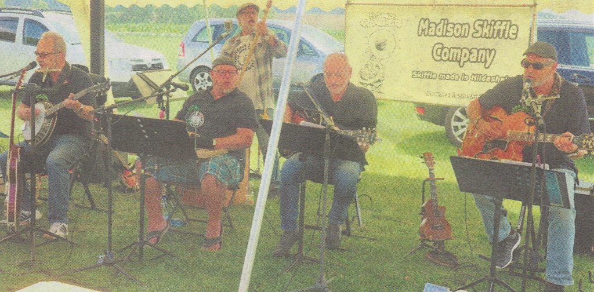

Seit über 40 Jahren geben sie in ganz Deutschland Konzerte und es macht ihnen immer noch großen Spaß. Dass sie auch nach so langer Zeit nicht in die Jahre gekommen sind und es immer noch drauf haben, bewiesen die Männer von der

"Madison Skiffle Company"

am Sonntag, den 21. Juli 2019 beim 1.Jazz-Frühschoppen auf dem Barfelder Sportplatz.

Da in diesem Jahr kein Beachhandball stattfand, waren wir auf der Suche nach einem besonderen Event, dass vor allem auch mal die ältere Generation anspricht. Unser Vorstandsmitglied Jürgen Klingebiel kam auf die Idee, die Madison Skiffle Company einzuladen. Die Hildesheimer Musiker waren sofort zu einem Auftritt bereit.

Mit Schlagern aus dem vergangenen Jahrtausend, internationalen Hits, Dixieland, Country und eigenen Songs begeisterten Earnie, Wolfram, Schradi, Alex und Eike das große Publikum, das in der Mittagssonne die Musik genoss.

Für das leibliche Wohl war mit Getränken, Leckereien vom Grill, Kaffee und Kuchen gesorgt. Hierfür bedanken wir uns bei der Eberholzer Dorfjugend, die uns tatkräftig beim Getränkeverkauf und am Grill unterstützt haben.

Die Veranstaltung war ein rundum gelungenes Event und nach der guten Resonanz ist auch eine Wiederholung möglich.
