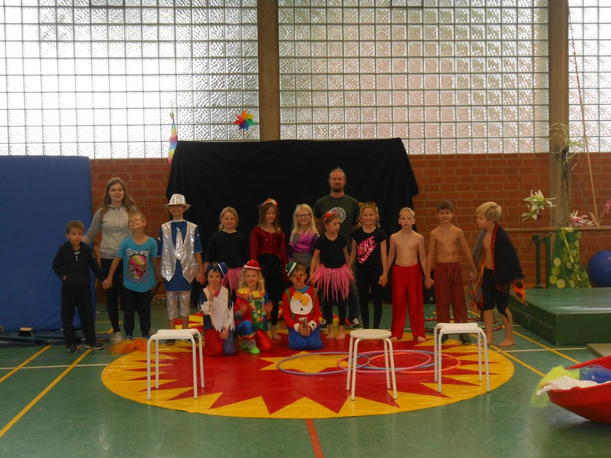

Vom 04. bis 06.10. 2016 hieß es in der Eitzumer Sporthalle erneut „Hereinspaziert, hereinspaziert“.

Drei Tage lang konnten die Kinder wieder unter Anleitung von Boris Tragico-Barth und dessen Assistentin Mena Ulrich verschiedene Kunststücke einstudieren. Und das mit vollem Erfolg.

Am Ende wurde den Eltern, Großeltern, Geschwistern und anderen Angehörigen eine Zirkusvorstellung unter dem Motto **„Captain Tim erfüllt jedem einen Wunsch“** präsentiert. Mit tosendem Applaus wurden die jungen Artisten für ihre Mühen belohnt.
