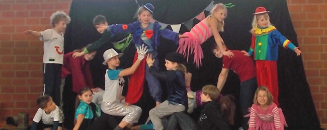

TSV Eitzum und MTV Barfelde richten gemeinsam das Kinderzirkusprojekt in Eitzum aus.

"Hereinspaziert, hereinspaziert" hieß es vom 22. bis 24.3.2016 in der Eitzumer Turnhalle: Drei Tage lang konnten die Kinder des TSV und des MTV  zusammen Zirkussachen ausprobieren. Jonglieren, Einrad fahren, auf Laufkugel und auf dem wackeligen Rola-Bola balancieren. Auch als Akrobat oder Clown probierten sich einige aus. Insgesamt 15 Kinder fanden großes Gefallen an der großen weiten Zirkuswelt. Dieses Projekt ist nicht das erste Gemeinschaftsprojekt zwischen TSV und MTV, und wie die Projekte zuvor, fand auch dieses Projekt großes Interesse und endete in einem riesen großen Kinder-Zirkus-Spass. Hannelore Lange und Sabine Wiening vom TSV Eizum planten das Event, und so wurde von den Kindern unter der Anleitung von professionellen Artisten mit sozialpädagogischer Ausbildung ein richtiges Zirkusprogramm einstudiert.
