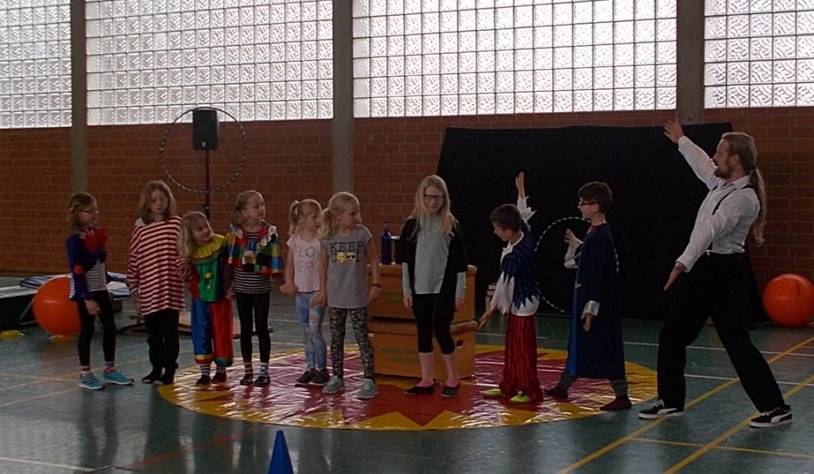

Und wieder einmal hieß es **"Manege frei"** in der Sporthalle in Eitzum.

Vom 11. bis 13. April 2017 konnten Kinder ab 8 Jahren in die Zirkuswelt eintauchen. 3 Tage lang wurde unter Anleitung des erfahrenen Artisten Boris Tragico-Barth aus Eitzum eine Zirkusgeschichte einstudiert, wobei die Kinder sogar teilweise in mehrere Rollen schlüpfen mussten. Ob Clown, Artist, Zauberer, Pirat, Jongleur oder auch Trapezkünstler und Einrad-Fahrer. Die Kinder haben viel Spaß am üben ihrer verschiedenen Kunststücke gehabt und am Ende dem Publikum eine Zirkusvorstellung präsentiert, die mit viel Applaus belohnt wurde.
