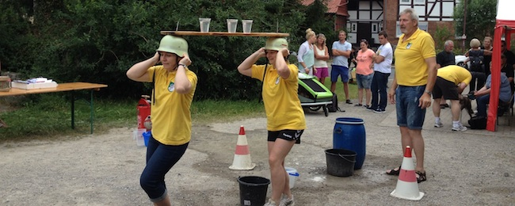
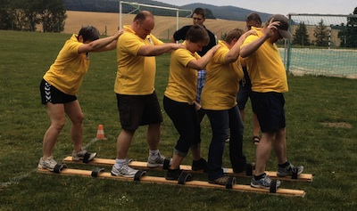
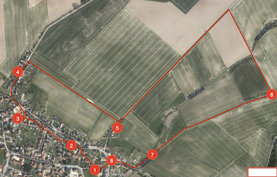

Am 8. August fand der diesjährige "Kampf am Zitterbach" der Feuerwehr Barfelde statt.

In der dritten Auflage hat sich auch der Vorstand des MTV zum "Kräftemessen" angemeldet und hat mit einem 3. Platz beachtlich abgeschnitten.

OK, zugegeben, das Bild zeigt die Gruppe in einer etwas unvorteilhaften Situation. Aber wer schon mal probiert hat, auf diesen Brettern mit mehreren Leuten voran zu kommen, hat dafür Verständnis.

Viele solcher Aufgaben hielt die Feuerwehr Barfelde beim "3. Kampf am Zitterbach" für die Teilnehmer bereit. Da ging es, auf dem Sportplatz eben um das Rückwärtsgehen auf "Skiern", aber auch um Denkaufgaben und Geschicklichkeit.

Die Strecke führte die Teilnehmer quer durch Barfelde. An der Feuerwehr (1) wartete schon die erste Aufgabe. Hier mussten Wasserbecher auf einem Brett balancierend transportiert werden. Ach ja, das ganze war dann noch an zwei alten Feuerwehrhelmen befestigt.
