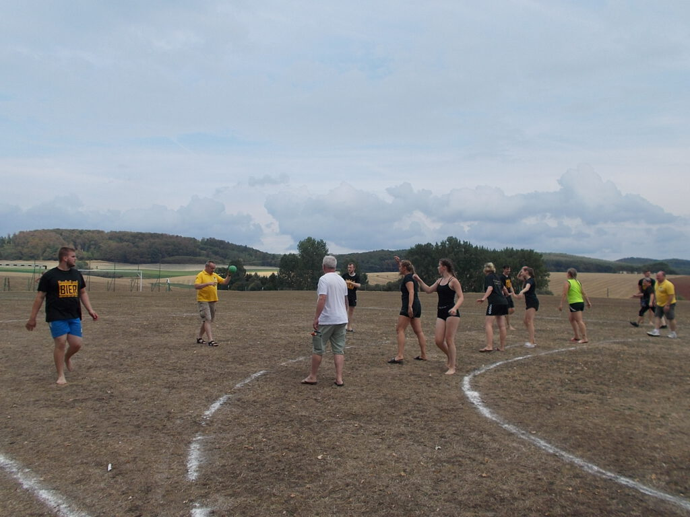

In Holland ist „Walking Handball“ längst etabliert, doch in Deutschland fristet diese Sportart noch ein Schattendasein. Das möchte Sabine Koch vom MTV Barfelde ändern: „Walking Handball ist ein körperloser Sport, bei dem der Spaß im Vordergrund steht.“ Und den hatten die Barfelder, als sie jetzt auf dem Sportplatz einen Schnupperkurs absolvierten.

 „Walking Handball“ wird ähnlich wie das Original gespielt. Die Spielfeldgröße und die Spieldauer sind etwas angepasst, bei den Regeln gibt es allerdings drei Ausnahmen:  Es darf nur gegangen, nicht gelaufen werden. Körperkontakt ist nicht erlaubt. Ein Torwurf zählt nur, wenn alle Angreifer die Mittellinie überschritten haben. „Diese Regeln sind sinnvoll, um die Verletzungsgefahr, die der Original-Handball mit sich bringt, zu verringern“, sagt Sabine Koch. Neben Ausdauer und Krafttraining könne auch die Koordination mit und ohne Ball trainiert werden. Wem also das normale Handballspiel zu schnell ist, sollte einmal Walking Handball ausprobieren.

 Sabine Koch hat aber noch eine andere Zielgruppe im Blick: Menschen mit kognitiven Einschränkungen: „Für Menschen mit Demenz ist dieser Sport gut geeignet“, sagt die Projektkoordinatorin „DemenzAktiv in der Region“ von der Alzheimer Gesellschaft Niedersachsen.

Sollten sich genügend Interessierte melden, könnte der MTV Barfelde Walking Handball in sein Angebot aufnehmen.

Auf dem Sportplatz in Barfelde gab es jetzt den ersten Schnupperkurs im Walking Handball. Foto: Dunja Heinemeyer
