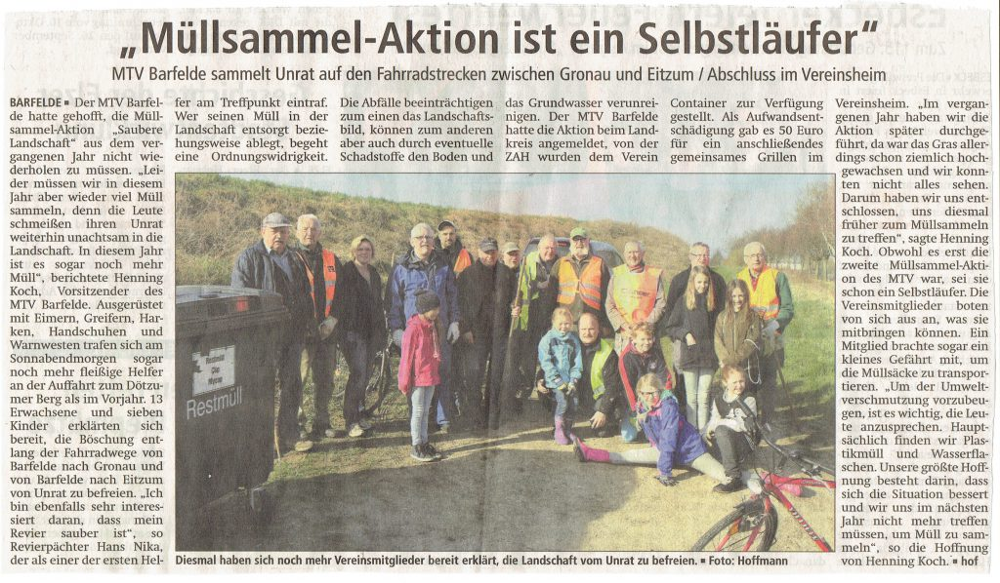

Auch im Jahr 2017 rief der MTV wieder zu einer Müllsammelaktion auf dem Radweg zwischen Gronau und Eitzum auf. Und so trafen sich im Frühjahr 13 Erwachsene und 7 Kinder am Dötzumer Berg um die Landschaft sauber zu halten. Es waren sogar noch mehr freiwillige Helfer als im letzten Jahr. Das war aber auch nötig, da leider auch der Müllberg im Vergleich zum Vorjahr gewachsen ist. Nach der Aktion traf man sich noch im Vereinsheim zum gemeinsamen Grillen.

#### **Vielen Dank nochmal an alle fleißigen Helfer !**

#### **Artikel aus der Leine-Deister-Zeitung:**

