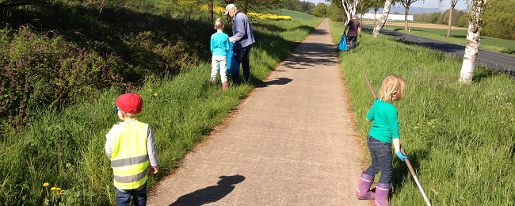
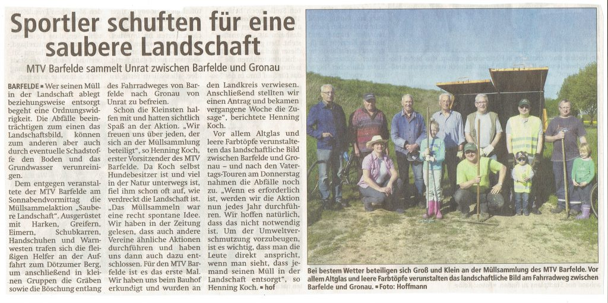

Am Samstag, den 7. Mai 2016 trafen sich die Mitglieder des MTV Barfelde zu einer Müllsammelaktion auf dem Radfahrweg zwischen Barfelde und Gronau. Viele Mitglieder folgten dem Ruf vom 1. Vorsitzenden Henning Koch und fanden sich gegen 9:00 Uhr am Dötzumer Berg ein.

Eigens für diese Aktion hatte uns der Landkreis einen Müllcontainer bereitgestellt, den die großen und kleinen Helfer aber "zum Glück"  nicht voll bekommen haben, immerhin fasste der ja 5 qm. Aber es war schon erstaunlich, was so alles aus den Gräben und Gebüschen rechts und links der Kreisstraße und des Radfahrweges zu Tage gefördert wurde. Klar, Flaschen und Bonbon-Papier erwartete wohl jeder der Teilnehmer. Aber riesige Gurkengläser und gleich einen ganzen Video-Recorder? Damit hätte wohl niemand gerechnet.

Im Anschluss fanden sich alle Beteiligten noch zu einem zünftigen Mittagessen im Sporthaus ein.

