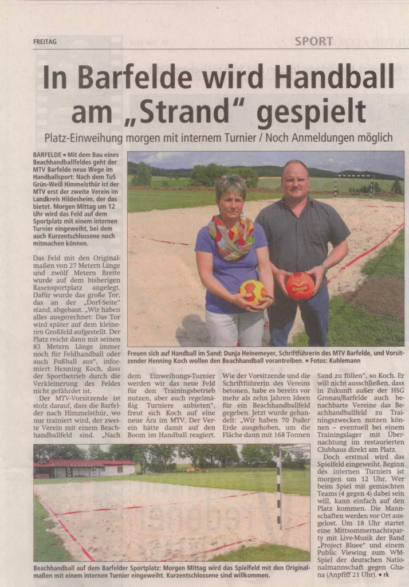
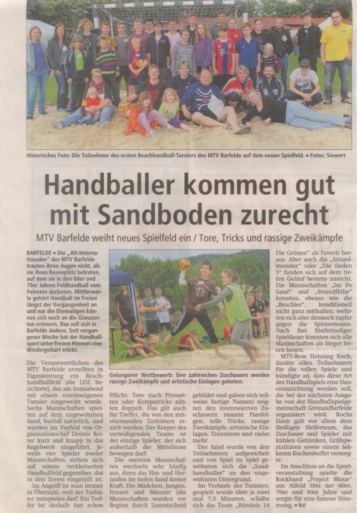

**Wie kriegen wir 330 Quadratmeter Wüste auf den Sportplatz ???**

Eine Punktlandung im Kalender wäre es wohl mit 5.400 Sandsäcken á 25 Kilo aus dem Hagebau nicht geworden. Schon allein die Entsorgung der ollen Plastiktüten hätte Tage und Unmengen an Gelben Säcken gekostet.

Scherz beiseite ... wir mussten 135 Tonnen vom besten Spielplatzsand für das Spielfeld bestellen. Insgesamt 5 mal musste der 40-Tonner aus Hemmingen mit 27 Tonnen Ladung rückwärts die Sportplatzauffahrt hinauffahren, bis das Spielfeld ausreichend mit Sand befüllt war. Und damit nicht genug. Auf dem Haufen aufgeschüttet erwies sich die Menge doch als etwas zu groß um sie mit der Hand zu verteilen.

Lange Rede kurzer Sinn: ein Bagger musste her. Adolf Michaelis, der schon die Auskofferarbeiten mit Willi Hunze und Klaus Bartels erledigt hatte, erklärte sich abermals kurzfristig bereit den Sand mit seinem Bagger zu verteilen. Ein echter Glücksfall für uns, sonst würden wir wohl heute noch den Sand verteilen und hätten ausser Blasen an den Händen wohl noch kein einziges Match absolviert. Aber dies sollte nicht unser letzter Glücksfall in Sachen Beachhandball sein. Unser Expräsident Matthias Völker, der die Geschicke unseres Vereins zwölf Jahre lang geleitet hat, bevor er uns schweren Herzens aus beruflichen Gründen nicht mehr unterstützen konnte, bekam Wind von unserem Projekt. Spontan wie er ist und immer schon war, entschloss er sich, den Verein mit Tausend Euro bei der Realisierung des Beachhandballfelds unter die Arme zu greifen. Groß war die Freude im Vorstand, als sich die Kunde verbreitete. Wir danken Matze für diese tolle Spende. Dies hat uns gezeigt das er dem Vorstand und dem Verein mehr als nur verbunden ist.

**Und am 21.06.2014 wurde das Beachhandballfeld mit einem internen Turnier eingeweiht.**

**Berichte aus der Leine Deister Zeitung vom Juni 2014:**

