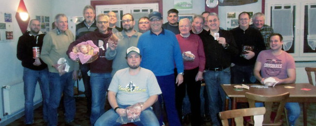

Am 21. November um 19.03 Uhr schrillte bei unserem Ex-Präsidenten, Matthias Völker, zuhause das Telefon. Am anderen Ende war der jetzige Vorsitzende, Henning Koch, der ihn daran erinnerte, dass seit drei Minuten Preisskat im Sporthaus sei, zu dem er sich doch angemeldet hätte. Also, Matze, nichts wie runter vom Sofa und ran an die Karten!

Um 19.20 Uhr konnte es dann losgehen und an sechs 3er-Tischen wurden in äußerst lockerer Atmosphäre ("Mensch, hau' doch das As da rein, Du Idi..." ;-)) drei 18er-Runden gespielt. Die Stimmung war wirklich sehr entspannt; niemand war verbissen auf der Jagd nach Punkten, sondern hauptsächlich aus Freude am gemeinsamen Spiel dabei. "18, 20, zwo", "Null Ouvert", "Grand", "Ich habe gar nichts", hallte es von den Tischen durch den Raum. So wurde es ein sehr kurzweiliger Abend.

In den Pausen konnten sich die Spieler mit heißen Würstchen und belegten Brötchen stärken und während der Spielrunden wurde das ein oder andere Kaltgetränk am Tisch genossen, was sich wiederum nur positiv auf die gesamte Gruppe auswirkte. Hier ein 'dummer Spruch' quer durch den Salon, da eine kleine Spitze vom Spieler 1 an Tisch 2 zu seinem alten Kumpel an Tisch 5, machte den Abend im 'Häusel' zu einem recht amüsanten Treiben.

Nach 324 Spielen konnte Vorsitzender Henning Koch dann um kurz vor Mitternacht die Siegerehrung vornehmen:

Mit 1040 Punkten ging der erste Platz in diesem Jahr an Manuel Dietz, gefolgt von Jürgen Klingebiel mit 954 Punkten; auf dem dritten Platz landete Heiner Kreth mit 877 Punkten. Aber auch der letzte Platz ging nicht leer aus - alle 18 Teilnehmer konnten sich wie immer über Fleisch- und Wurstpreise freuen.
