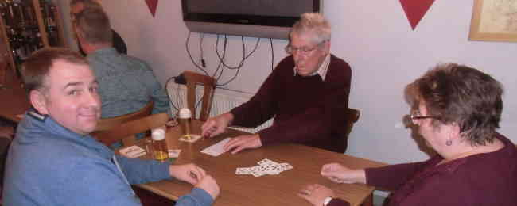

Da hat er gut Lachen (vorn links): Sieger unseres diesjährigen Preisskats wurde Christian Strübig. Bereits in der ersten Spielrunde liefen ihn die Karten förmlich um und er hatte am Ende des Abends mit über 1.100 Punkten deutlich die Nase vorn. Am wenigsten Glück hatte in diesem Jahr Matthias Völker, der sich aber auch noch über einen Trostpreis freuen konnte.

Für die Organisation des Turniers zeichnete Petra Lemke verantwortlich, für die Preise Jürgen Klingebiel.

Mit Kaffee, Kuchen, Buletten und belegten Brötchen sowie Kaltgetränken wurden die Kartenspieler von Siegfried Gläser und Henning Koch versorgt. Allen Beteiligten an dieser Stelle ein herzlicher Dank für ein gelungenes Skatturnier!
