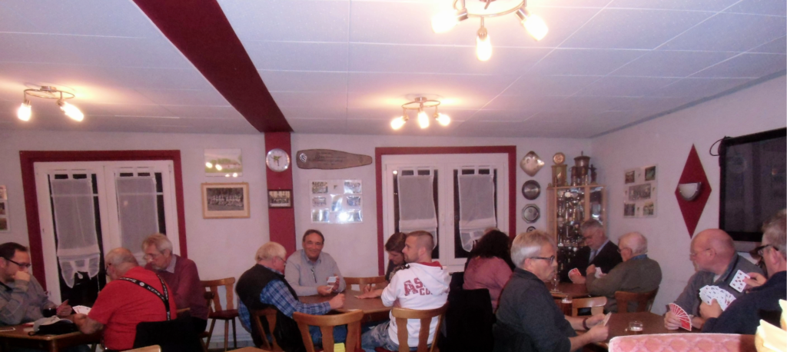
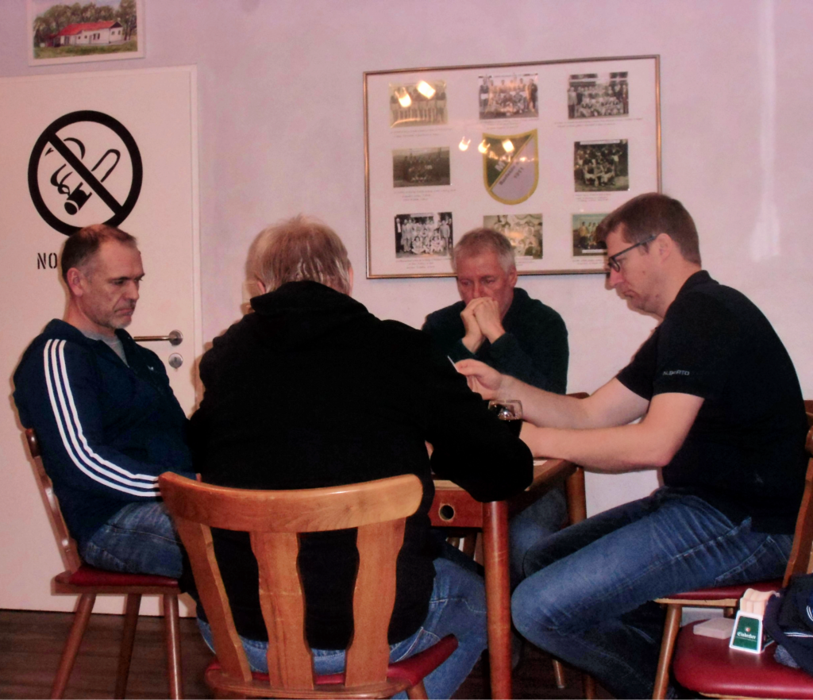
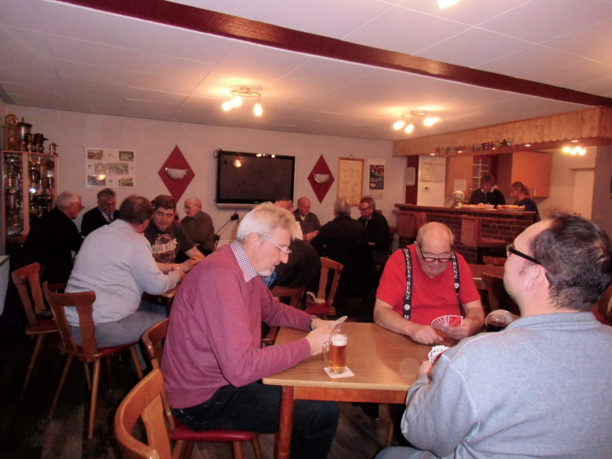
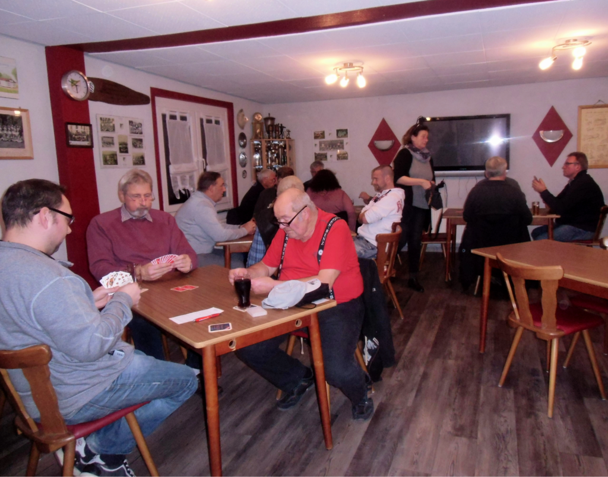

Der traditionelle Preisskat des MTV Barfelde fand in diesem Jahr am 16. November statt.

Nachdem der 1. Vorsitzende Henning Koch eine kurze Eröffnungsrede gehalten und allen Spielern und Spielerinnen "Gut Blatt" gewünscht hat, machten sich 19 Skatspieler auf die Jagd nach Punkten. Heidrun und Andreas Schwartz sorgten zwischendurch für das leibliche Wohl mit Getränken und belegten Brötchen, die liebevoll von Melanie Harbusch, Dunja Heinemeyer und Heidrun Schwartz vorbereitet waren. Sabine Koch übernahm die Auswertung und die Siegerehrung. Alle Teilnehmer wurden mit Preisen belohnt, die zuvor von Jürgen Klingebiel organisiert wurden.

Es war wieder ein gelungener Abend. Vor allem die entspannte, lockere Atmosphäre wurde von allen Teilnehmern gelobt. Nächstes Jahr kommen alle gerne wieder.

#### **Vielen Dank nochmal an alle Helfer für den reibungslosen Ablauf !**

- 
- 
- 
