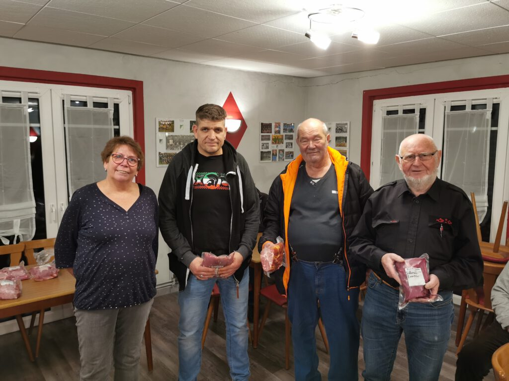

Der jährliche Preisskat beim MTV Barfelde erfreut sich nach wie vor großer Beliebtheit. Organisatorin Petra Möller konnte jetzt im vereinseigenen Sporthaus 18 Spieler und Spielerinnen begrüßen, die unter 2G-Bedingungen um die begehrten Fleischpreise kämpften. Bei einem Startgeld von fünf Euro wurde erstmals nach den neuen Skatregeln gespielt, die von allen Teilnehmern sehr schnell verinnerlicht wurden. Nach drei Durchgängen stand Dieter Nietsch aus Betheln als Sieger mit 1847 Punkten fest. Mit 1759 Punkten landete Dirk König auf dem zweiten Platz vor Norbert Thiemt mit 1718 Punkten. Das Foto zeigt von links Petra Möller, Dirk König, Norbert Thiemt und Dieter Nietsch.

Foto: Peter Rütters

