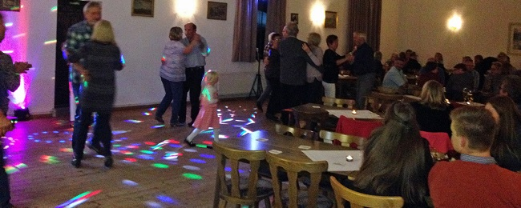

Gebührend gefeiert wurde am vergangenen Wochenende noch einmal das 105-jährige Vereinsbestehen mit einem Tanzvergnügen. Bereits im August hatte der erste Teil der Feierlichkeiten mit einer Beach-Sommerparty auf dem Sportplatz stattgefunden. Nun folgte der zweite Festakt im Saal der Gaststätte "Zum Kronprinzen". Die Verantwortlichen zeigten sich hocherfreut, dass um die 100 Mitglieder und Freunde des Vereins den Weg hierher gefunden hatten.

Zu Beginn des Abends verlas Vorsitzender Henning Koch noch einmal die Namen der bereits im August geehrten langjährigen Mitglieder und wies darauf hin, dass es eben die Mitglieder sind, die den Verein mit Leben füllen und er erst durch sie über eine solch lange Zeit erfolgreich bestehen kann.

Nach einem gemeinsamen warmen Essen wurde kräftig getanzt. In gewohnter Manier sorgte DJ Michael Sürig dafür, dass die Tanzfläche immer gut gefüllt war, sowohl von den "Oldies" als auch von der zahlreich vertretenen Jugend. Bis in die frühen Morgenstunden wurde viel gelacht, getrunken und das Tanzbein geschwungen. Alle waren sich einig, dass die gelungene Feier ein schöner Abschluss des Jubiläumsjahres war, und freuen sich sicher schon auf das Jahr 2021, in dem das 110-Jährige ansteht.
