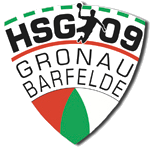

# HSG 09 Gronau/Barfelde

### Handballspielgemeinschaft 09 Gronau / Barfelde

Die HSG09 ist eine Spielgemeinschaft zwischen der Handballsparte des TSV Gronau (Leine) und dem MTV Barfelde.

Sie wurde 2009 gegründet und besteht aus zahlreichen Mannschaften im Jugend- und Seniorenbereich.

Ergebnisse, Tabellen und Spieltermine aller Mannschaften bei nuLiga:

[NuLiga HSG 09 Gronau/Barfelde](https://hvnb-handball.liga.nu/cgi-bin/WebObjects/nuLigaHBDE.woa/wa/clubInfoDisplay?club=32678) oder direkt [hier auf der Seite](spielplan).

